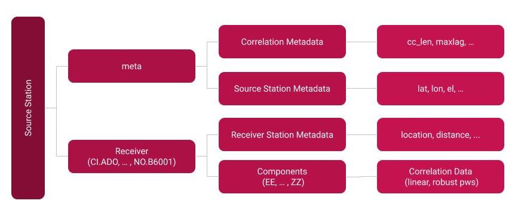
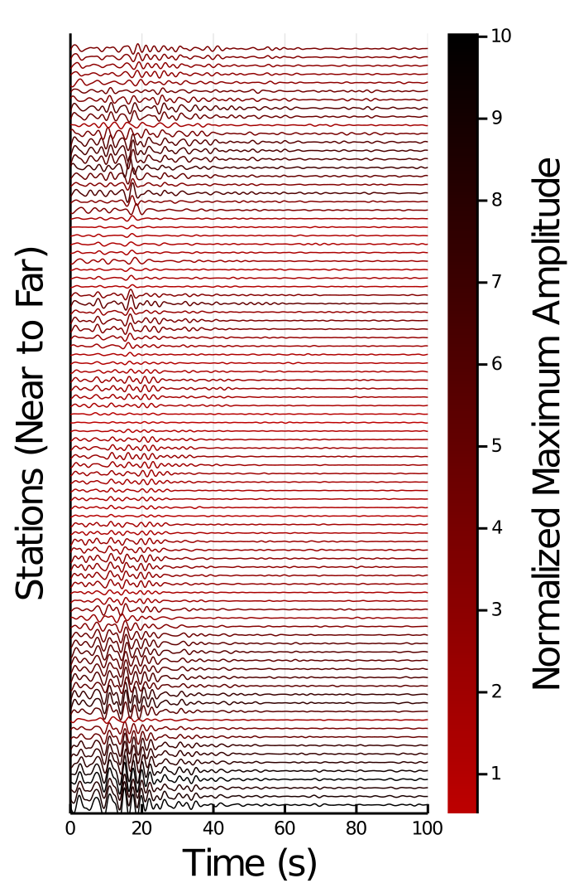

# SeisCore.jl

SeisCore.jl contains codes for replication of our Ambient-Noise Cross-Correlation method in Julia using High Performance Computing 
and instructions for accessing our stacked product.

## Getting Started
Our data product is stored in an Amazon Web Services S3 cloud storage [bucket](https://s3.console.aws.amazon.com/s3/buckets/seisbasin?region=us-west-2&tab=objects).
 Currently access is restricted to team members with public access expected in early 2020. Downloading the product is possible through the AWS 
 user interface or directly using terminal after configuring your amazon [credentials](https://docs.aws.amazon.com/cli/latest/userguide/install-cliv2.html) 
 using the command `aws configure` and then downloading our product, either a single file or folder by using appropriate file pathing:
 ```
    aws s3 cp s3://seisbasin/source_processed/2017/2017_CI.CHN.h5 ~/Downloads/
    aws s3 cp s3://seisbasin/source_processed/2017/ ~/Downloads/ --recursive
 ```

## Data Access 
We have chosen to store our files in the `h5` format given its multi-language readability ([see docs](https://juliaio.github.io/HDF5.jl/stable/)). We provide documentation here for both
Julia and Python. Below we describe the hierarchical structure of each file and how read our `h5` files into julia to access datafields:  
  
### Contents
Each file contains the following
1. Source metadata, accessed via the group `"meta"`:
    a. Correlation metadata: `corr_type`,`cc_len`, `cc_step`, `whitened`, `time_norm`, `notes`, `maxlag`, and `starttime`.
    b. Source location metadata: `lat`, `lon`, `el`, `dep`, `az`, and `inc`.
2. Reciever metadata, accessible as a subgroup in the recievere group via `"meta"`:
    a. Correlation metadata: `dist`, `azi`, `baz`.
    b. Receiver location metadata: `lat`, `lon`, `el`, `dep`, `az`, and `inc`.
### In Julia
```julia
julia> using SeisIO, SeisNoise, HDF5
julia> fid = h5open("2017_CI.CHN.h5","r")
julia> SOURCE = read(fid)
``` 


### Example
To access desired stacktype, filter desired correlations, and access metadata, your script might leverage the following `SeisCore.jl` functionality found in [docs](https://github.com/Julians42/SeisCore.jl/tree/master/docs/dataaccess.jl). We include an example of the workflow below:
```julia
# select example parameters 
name, stacktype, component, filter = "CHN", "linear", "ZZ", "NO.B4"
frequency_plots = [[0.1,0.2],[0.2,0.5],[0.5,1.]]
lw = 0.5 #Decrease line thickness by half from default for cleaner plots
scale = 0.1 # inversely related to plot amplitude - may need to scale accordingly
rootdir = "/Users/julianschmitt/Desktop/SeisPlots" # chose root directory for plots

# filter and extract correlations and plot
fcorrs = get_corrs(file, stacktype, component, filter)
vert_plot(fcorrs, name, component, filter, stacktype) 
```
Which produces a plot for each of the 3 selected frequency plots. For example:  
  


## Reproducibility
This section details highlights of our methodology and details how to begin AWS cloud computing in Julia for yourself!

[launch EC2](https://github.com/Julians42/SeisCore.jl/blob/master/docs/launch_EC2) contains instructions and video link for launching an AWS instance and installing Julia for cloud computing. Further docs to come... Happy Computing!

